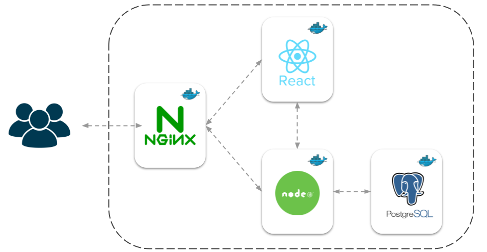

# Seto laulu alternatiivne noodikiri
Current application is the digital solution for creating and listening to notations of Seto multi-part singing in an alternative notation system. 
It is part of a research project called **"Teaching Seto polyphonic singing with the help of an alternative musical notation"** by the Estonian Literary Museum.


## Components



#### React Frontend
- The client-side part of the application.
- Allows the user to create and listen to notations, communicates with the backend via API requests.

#### Node.js Backend
- The server-side part of the application.
- Handles the business logic, processes API requests from the frontend, and interacts with the database.

#### Postgres Database
- Relational database where the application's data is stored.

#### Nginx:
- Serves as the web server and reverse proxy for the React frontend.
- It routes incoming HTTP requests to the appropriate service (in this case, the React frontend).

#### Docker & Docker Compose:
- Each part of the application is containerized using Docker.
- Docker Compose is used to orchestrate and manage these containers.


## Running app on server (production)
The following lists minimum instructions for running the application on a server. 

It's fair to state that the whole setup (using Nginx, provided configuration examples etc.) is somewhat opinionated - it's just one way how to do it. 
I have tried to make the setup process as straightforward as possible, and got it working as such, but it must be noted that
I have fairly little experience when it comes to system administration. So, feel free to change the configuration
and the setup logic that follows.

Make sure you have **Docker** and **Docker Compose** (2.17.0+) installed:

- https://docs.docker.com/engine/
- https://docs.docker.com/compose/install/standalone/


#### Initial setup
Create **.env**, **nginx.conf** and a **docker-compose.yml** files in the root directory where you want to run the application. 
Use *.example* files from the code repository as base, but change the values according to your needs. Values that should be changed 
are marked by comments.

Additionally, copy the database scripts from the *database/scripts* directory and change the password for app_user in
*init-db.sql* (be sure that it matches the one in .env). The *init-db.sql* creates the necessary schema, tables and a non-superuser
role for the backend to interact with the database.

The *insert-data.sql* script inserts a new application-level admin user
that can be used for in-app user management. Be sure to change the corresponding password hash in the script file.
You can use **Bcrypt-Generator** to generate the hash: https://bcrypt-generator.com.

At the end you should have the following project structure:
```
/
├── .env
├── docker-compose.yml
├── nginx.conf
└── database/
    └── scripts/
        ├── init-db.sql
        └── insert-data.sql
```

#### Build Docker images
```shell
docker-compose build
```
This creates the Docker images and also takes care of the initial database setup by running the scripts listed above.

#### Build Docker containers
```shell
docker-compose up -d
```
This builds and runs the Docker containers.

## Releasing changes
Releasing new changes is fairly simple, you just need to rebuild the Docker images and containers. Code gets pulled directly from GitHub - 
specific branch is denoted by BRANCH parameter in *.env* file. The default branch is 'master', which should be used for all new releases.
```shell
docker-compose down
docker-compose build
docker-compose up -d
```

#### Rollback
Change the branch parameter in *.env* to specific tag version (I will create a tag for each new version). For example:
```yaml
BRANCH=1.0.0
```
Then follow the regular release process.
```shell
docker-compose down
docker-compose build
docker-compose up -d
```

#### Accessing logs
```shell
docker-compose logs -t -f --tail 10
```

## Local development
Local development requires database setup. The easiest way is to follow the instructions listed above (*Running app on server*). Alternatively, you can set up the database yourself and run the scripts in *database/scripts*.

#### Clone the repository
```shell
git clone https://github.com/taneltorn/setoalt.git
cd setoalt
```

#### Create and update .env
```shell
cp .env.example .env
```
Update the values based on your environment. For example:
```
LOG_LEVEL=info

POSTGRES_HOST=localhost
POSTGRES_PORT=5432
POSTGRES_DB=setoalt
POSTGRES_USER=postgres
POSTGRES_PASSWORD=postgres

ALLOWED_ORIGIN=http://localhost:5173
JWT_SECRET_KEY=somesecret
DB_USER=app_user
DB_PASSWORD=app_password

VITE_ENVIRONMENT=local
VITE_API_URL=http://localhost:3000
```

#### Running backend
```shell
cd api
npm run dev
```

#### Running frontend
```shell
cd ui
npm run dev
```

You should then be able to access the UI at: http://localhost:5173